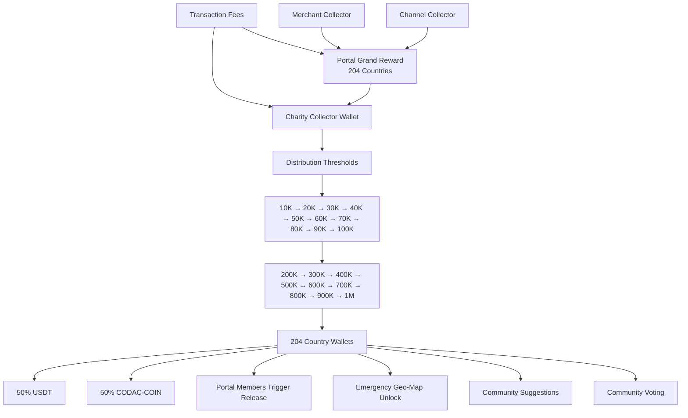

# 📊 Charity Collector Wallet Flow

## Overview

The **Charity Collector Wallet** is one of the core components of the CODAC-COIN ecosystem. It is designed to collect funds from multiple sources and distribute them transparently to **204 Country Wallets** through a community-governed, threshold-based release system.

---

# System Flow

---

# Funding Sources

The Charity Collector Wallet receives funds from two independent sources.

## 1. Portal Grand Reward

The Portal Grand Reward is funded by:

- Transaction Fees
- Merchant Collector
- Channel Collector

These funds accumulate before being transferred to the Charity Collector Wallet.

---

## 2. Direct Transaction Fee Allocation

A designated percentage of every transaction fee is sent directly to the Charity Collector Wallet to support charitable and community initiatives.

---

# Distribution Thresholds

Funds are released only when one of the following thresholds is reached:

| Stage | Threshold |
|------:|----------:|
| 1 | 10,000 |
| 2 | 20,000 |
| 3 | 30,000 |
| 4 | 40,000 |
| 5 | 50,000 |
| 6 | 60,000 |
| 7 | 70,000 |
| 8 | 80,000 |
| 9 | 90,000 |
| 10 | 100,000 |
| 11 | 200,000 |
| 12 | 300,000 |
| 13 | 400,000 |
| 14 | 500,000 |
| 15 | 600,000 |
| 16 | 700,000 |
| 17 | 800,000 |
| 18 | 900,000 |
| 19 | 1,000,000 |

Future governance may introduce additional threshold levels.

---

# Distribution Rules

Whenever a threshold is achieved:

- All **204 Country Wallets** receive their allocations simultaneously.
- Each allocation consists of:
  - **50% USDT**
  - **50% CODAC-COIN**

This ensures balanced liquidity while encouraging participation in the CODAC ecosystem.

---

# Emergency Release

The Charity Collector Wallet supports emergency releases outside the normal threshold schedule.

Emergency releases may be initiated for:

- Natural disasters
- Humanitarian crises
- Medical emergencies
- Infrastructure recovery
- Community emergencies

The emergency release process uses the CODAC Geo-Map System to identify affected regions and prioritize assistance.

---

# Community Governance

The Charity Collector Wallet operates under a community-driven governance model.

Members may:

- Submit funding proposals
- Recommend charitable initiatives
- Vote on projects
- Monitor fund allocation
- Review completed projects

This governance model promotes transparency, accountability, and equitable distribution.

---

# Core Principles

- 🌍 Global coverage across 204 participating countries
- 💰 Dual-asset distribution (50% USDT / 50% CODAC-COIN)
- 📈 Threshold-based funding model
- 🗳️ Community governance
- 🚨 Emergency disaster response
- 🔒 Locked core architecture for stability
- 🔄 Future upgrades through governance

---

## Status

**Version:** Design Freeze v1.0

**Status:** Locked Architecture (Upgradeable)

Part of the official CODAC-COIN ecosystem documentation.
